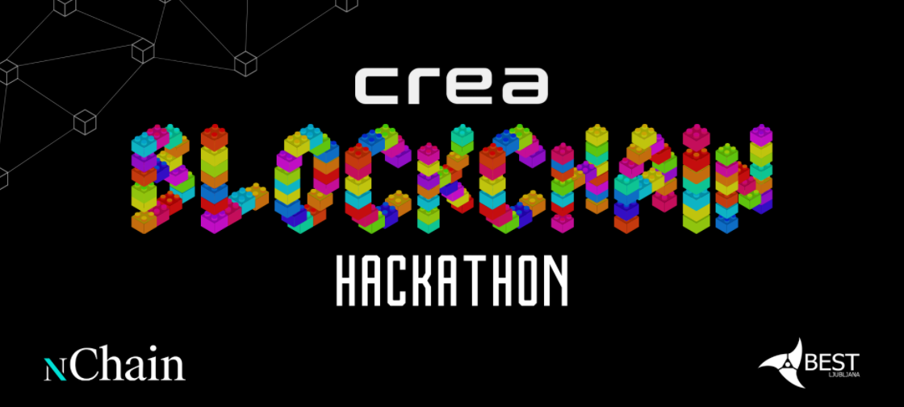
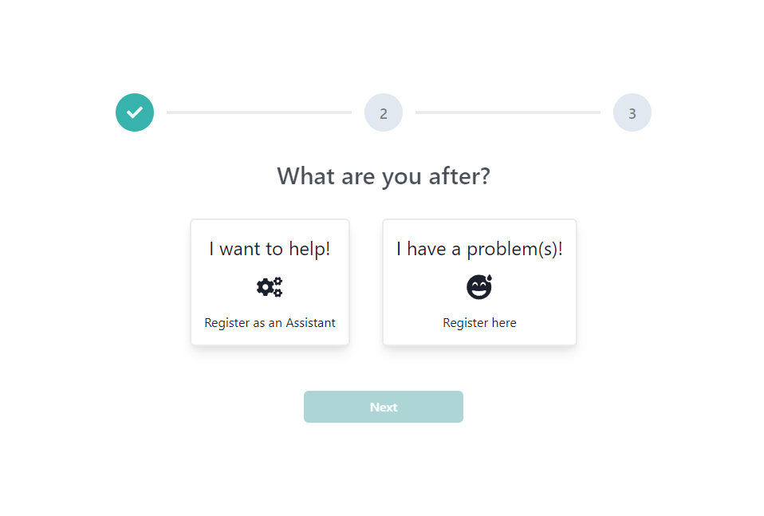
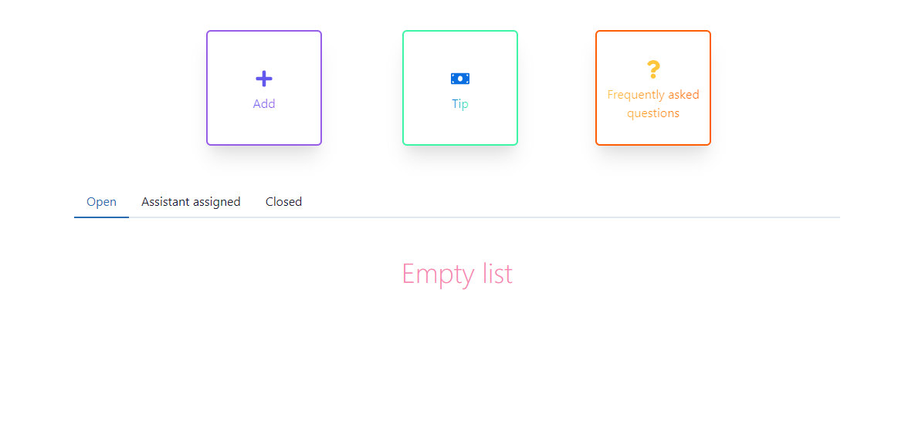
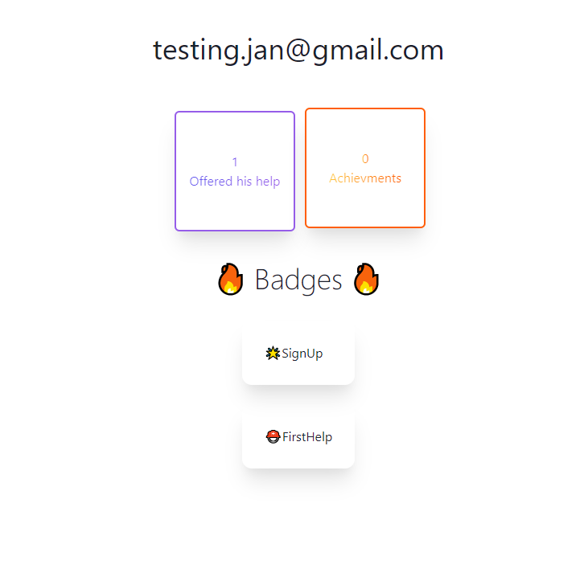
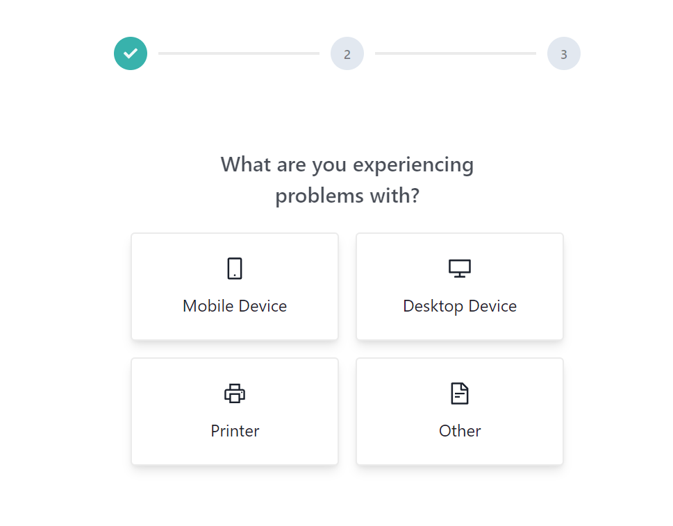
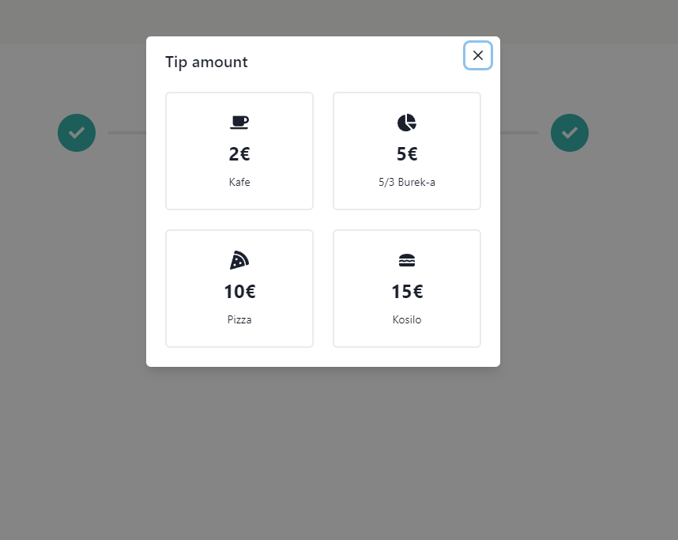

# Cherry Pick

This is our project that won the first place at the 2022 nChain Hackathon. We had 24 hours to create something that would brighten the day of the elderly and/ or our partners. We also had to use Blockchain technology form some aspect of the project. We are Cherry pick, [Lan](https://github.com/LanVukusic) & [Jan](https://github.com/janvasiljevic), known by our ability to cherry pick the important commits 5 minutes before the deadline.  



## Idea

Sometimes elderly people struggle with technology - often mundane problems that can be quickly solved by more tech savvy younger population. A friend once told me a story, that his grandpa accidentally deleted the Chrome shortcut icon from his desktop. He was then called to restore back the Internet. While we, as programmers, might find stories like these amusing, not everyone has a relative who "knows computers".  

We thought of a platform, that would connect the two generations together. Those who need the help can create a special account, where they can post their problems in a simple and user friendly manner. Others, the so called helpers or assistants, can create a special technician account, where they see these offers and can provide the assistance. The platform is more good will oriented, and offers the ability of small payments in form of tips. The technicians are also rewarded with NFTs for certain milestones, like signing up, providing help to one person etc.

## Disclaimer

This Readme and associated documentation was made after the Hackathon, to better document the project and so we can reflect upon it down the road. All the code and everything else is the same as it was at the deadline.

## Project setup

To setup the project you will need the following software and tools:

- docker
- docker-compose
- make
- node
- yarn
- free port 5432, 4000, 3000 and 80
- a Metamask wallet with the following network
  - GoChain Testnet
  - `https://testnet-rpc.gochain.io/`
  - 31337
  - GO
  - `https://testnet-explorer.gochain.io/`
  - You will also need to import some tokens if you wish to see them:
    - SignUp token: `0x03a348BA542b59F9243892EAd692E497601cE7A5`
    - GoodSamaritan token: `0x83606Ca6a9Ed28979774E2e631c1648415799496`
    - FirstHelp token: `0xC1C8f2fb1C2f68953F576E93E126557856b7471E`

Also take note, that the wallet that pays the fees for the transactions needed for the NFTs reward to function, may run out of funds. Go to [https://faucet.gochain.io/](https://faucet.gochain.io/) and add some Go to `0x3fa9515050Dea4a1F3a81253417562320b9D71EA`.  

To spin up the project run the following 2 commands

```sh
make yarn
make dev-up
```

After Prisma migrations are applied, you should be able to visit the following two addresses:

- `http://localhost/` - the main platform
- `http://localhost/api/docs` - API documentation for NestJS backend  

## Some thoughts

Here are some things that we wish we had time to do:

- integrate [moneybutton](https://www.moneybutton.com/) into the platform to make payments to assistants possible
- make a functioning Frontend authentication system (currently the cookies/ tokens aren't refresh, so after 2 hours the app stops working)
- make the achievements/ NFT part more reusable and easier to develop with  
- use gRPC instead of HTTP for inter container communication
- build a production stack of the project

## Some images of the Website







## Our thanks

Thanks to everybody that made the event possible and those who supported us during the HackathoN.
